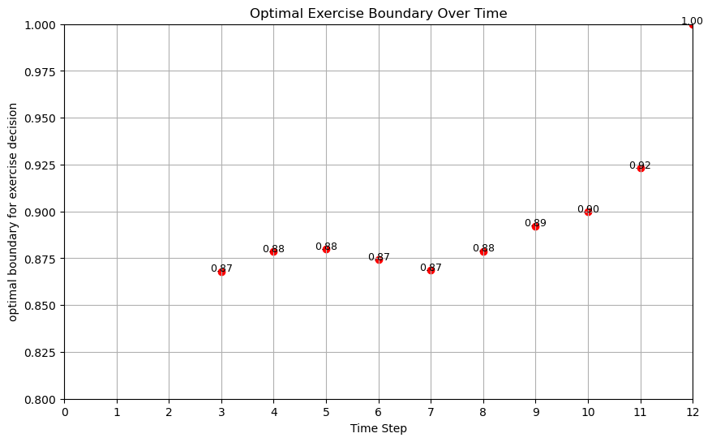
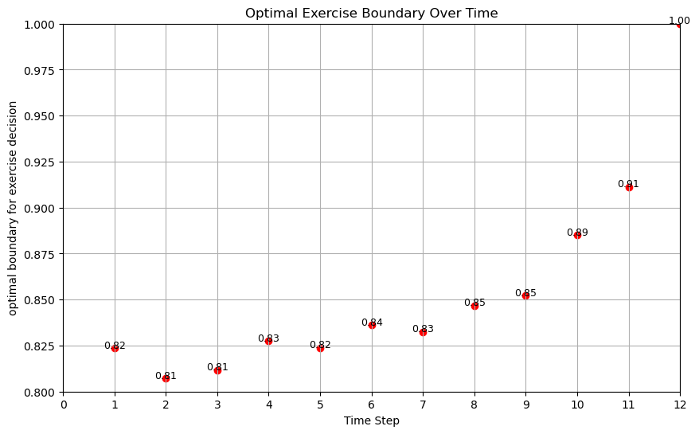

# 4- Super LSMC
Now that you understand how the LSMC method works, let's improve it until we get the SUPER LSMC method!

The LSMC is flexible and can work great, but it faces many challenges when one needs to apply this in practice and calibrate a model on observed option prices.
- Pricing one option is time consuming
- Need to price many options
- Need to "RE"-price many options for the optimization
- The optimization is noisy

It's a disaster!

But we solve all of this for you!

## 4.1- Initial State Dispersion (ISD)
We can improve the estimation of optimal stopping time. The idea is simple, we disperse the initial values of $$S$$.

See Rasmussen (2005)

In the extended example we get a rather poor exercise bondary

**Comparison of Exercise Boundaries**

  
**Figure 1:** Exercise boundary without Initial State Dispersion (ISD)

  
**Figure 1:** Exercise boundary with Initial State Dispersion (ISD)

### Reference
Rasmussen, N. S. (2005). Control variates for Monte Carlo valuation of American options. Journal of Computational Finance.

## 4.2- ISD and Homogeneity and Multi-Strike Pricing

## 4.3- Markov Property and Multi-Maturity Pricing

## 4.4- Bootstrapping

## 4.5- ISD and Greeks

## 4.6- ISD and model parameters

## 4.7- Gigantic calibration setup

## 4.8- Producing reliable hyperparameters for calibration

## 4.9- How to use our hyperparameter outputs

