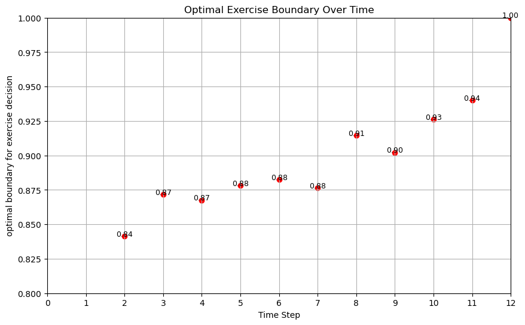
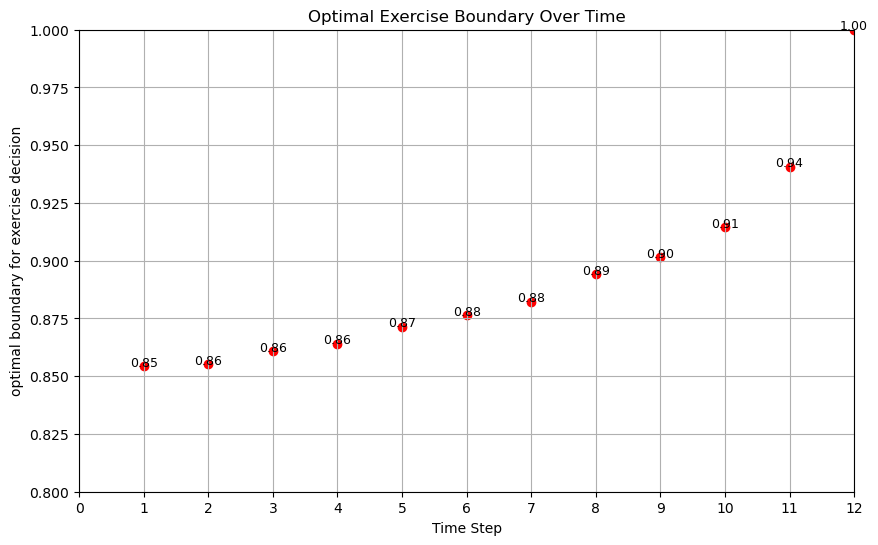

# WORKING DOCUMENT
## As of right now, this document is only a rough draft that only contains parts of ideas.

# 4- Super LSMC
Now that you understand how the LSMC method works, let's improve it until we get the SUPER LSMC method!

The LSMC is flexible and can work great, but it faces many challenges when one needs to apply this in practice and calibrate a model on observed option prices.
- Pricing one option is time consuming
- Need to price many options
- Need to "RE"-price many options for the optimization
- The optimization is noisy

It's a disaster!

But we solve all of this for you!

## 4.1- Initial State Dispersion (ISD)
Initital State Dispersion (ISD hereafer) means that each simulated path is not starting at the same initial values.
In the original and extended examples we simulate the stock price, and all paths are starting at \(1)\.
This does not have to be the case.
There three main reasons to use an ISD.

1. **Improve the approximation of the optimal stopping time:** By spreading the paths enough, we get paths that are on both sides on the exercise boundary at each time step, and it then gets possible to better estimate that boundary.
Having a wider spread helps mitigating over-fitting of the polynomial and thus over-fitting of the optimal stopping time to the simulated sample.
See Rasmussen (2005).

We cover this below

2. **Estimate the pricing function and Greeks:** Since the data is spreaded at \(t=0)\, we can do a cross-sectional regression, just like we do in the LSMC algorithm. We can evaluate the function at a specific point to obtain a price estimate, and we can evaluate the derivatives of that function to obtain Greeks.
See Letourneau & Stentoft (2023).

We cover this in a section 4.?

3. **Combine with Homogeneity:** For all dynamics where future returns does not depend on current stock price, i.e., dynamics with the homogeneity condition, using an ISD allows pricing multiple options with different strike using a single simulation.
See Letourneau & Stentoft (2025 w.p.)

We cover this in a section 4.?

### Let us see how using an ISD can improve the approximation of the exercise boundary in the extended example

In the extended example we get a rather poor exercise bondary

**Comparison of Exercise Boundaries**

  
**Figure 1:** Exercise boundary without Initial State Dispersion (ISD)

  
**Figure 2:** Exercise boundary with Initial State Dispersion (ISD)

There are multiple factors affecting the quality of the approximation of the optimal stopping time.
- **Domain:** ceteris paribus, when doing the cross-sectional regression, the larger the domain (how wide the values of the independent variable are spreaded), the lower the over-fitting, but the larger the potential bias on the actual function. So, the ISD will reduce the over-fitting, but if we go too large, we end end up increasing the bias. So, there is a compromise.

- **Polynomial order:** ceteris paribus, when doing the cross-sectional regression, the higher the polynomial order used, the lower the bias in approximating the value function, but the higher the potential over-fitting. Again, there is a compromise

- **Number of simulations:** Increasing the number of simulated paths will make the approximation of the value function with the cross-sectionnal regression converge to a specific value. A value which we know will be biased (unless the true value function was specifically a polynomial of lower order than the one used for the regression.) That bias might be large or small, depending on the factors above.

Our recommendation is to use an ISD, as many simulations as possible considering memory and computing time limits, and a relatively high order polynomial. We find using a polynomial of order \(9)\ to be good enough.

Let us explore how a wider ISD and polynomial of order \(9)\ might affect the approximation of the optimal exercise boundary.

  
**Figure 3:** Exercise boundary with larger ISD and polynomial of order 9

Here, we probably need to increase the number of simulated paths. 
However, suppose that we are getting close the memory limit and can't increase the number of paths.
This may seems unlikely to you because we have only cover a basic case with a single state variable which is the stock price. However, we will cover much more complex situations with many state variables, and we will hit the memory limit eventually.

In a later section, we will cover a method that provides a work around.

### References

Letourneau, P., & Stentoft, L. (2023). Simulated Greeks for American options. Quantitative Finance, 23(4), 653-676.

Letourneau, Pascal and Stentoft, Lars, Efficient Pricing of Large Panels of Options (2025). Available at SSRN: https://ssrn.com/abstract=4094237 or http://dx.doi.org/10.2139/ssrn.4094237 

Rasmussen, N. S. (2005). Control variates for Monte Carlo valuation of American options. Journal of Computational Finance.

## 4.2- Repeats
Back on the Extended Example, one issue with the estimate is that we do not know how good that estimate is.

- In theory, we know the price will converge to the true price and the number of paths and polynomial order are increased.
- In practice, we know the price will converge to a biased price as we increase the number of paths because we use a limited polynomial order.
- Right now, with only one price estimate, we do not know how good it is.

The solution is to repeat the simulation multiple times. Because all repetitions are independent, the distribution of estimates follows a normal distribution and we can then get a confidence interval.

## 4.3- Bootstrapping
The concept of using the average over multiple repeats to improve the price estimate can also be applied to the approximation of the optimal exercise boundary.
We present our algorithm in a simple example and show how to improve the exercise boundary

  
**Figure 4:** Exercise boundary with larger ISD, polynomial of order 9, and bootstrapping with 50 repeats

### References
Létourneau, P., & Stentoft, L. (2019). Bootstrapping the early exercise boundary in the least-squares monte carlo method. Journal of Risk and Financial Management, 12(4), 190.

## 4.4- Saving optimal stopping time betas and re-using them
In a simple implementation of the LSMC, all parts of the algorithm are ran in sequence.
However, there are situations where running by parts and saving the data between intermediate steps, might be useful.
In this example, we will improve the estimation of the optimal stopping time using bootstrapping, and then we will use a simulation without an ISD to price the option from the extended model.

## 4.5- ISD and Greeks

## 4.6- ISD and model parameters

## 4.7- Gigantic calibration setup

## 4.8- Producing reliable hyperparameters for calibration

## 4.9- How to use our hyperparameter outputs

